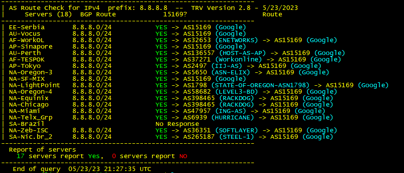

# Tony's Route View
- The TRV (Tony's Route View) query script.
- This bash script will show the AS path for a prefix from multiple routeview servers
- Version 2.8 - 5/28/2023
- Written by Tony Bemus  
- Web Version available at: https://bemuswaf.bemushosting.com/
- NO GUARANTEES OF SUPPORT and you run at your own risk

 ### Dependencies:
 - Tested on Ubuntu but should work on any Linux variant 
 - Required packages: bash, whois, nc

 ###  Usage:  
- Example: trv -p 195.110.96.1
- Example: trv show servers (show a list of servers)
- Example: trv show last' (show last query)

 ###  Output: 
server name - server bgp route -  Query Status -  AS Path Route 

 ### Query Status: 
- YES = AS Found in Route
- NO = AS not Found in Route
- No Response = Server did not respond
- No Route = Server reports '% Network not in table'

### Options

 --cleanup)            Clean up the Proxy Processes and fifo files

 -f|--full)            Get the full route view output

 -nc|--nocolors)        Turn off all Colors (No Colors)

 -o|--out)             Send the output of the query to a file

 -p|--prefix)          Enter the IPv4 or IPv6 prefix (auto detecting version)

 -r|--repeat)          Repeat Mode,  repeats the same query untill the CTRL + C is entered

 -s|--server)          Run query on individual route view server.

 sh|show)              Run the following show commands:
                          Options:  s ser servers a as asn-list l last v ver version h his history
                          Example:  trv show hisory [number of history items]

 -his|--history)       How many history items to list.

 -h|--help)            Show this help page.

 ### Screen shots:
 - ./trv -p 8.8.8.8 -a 15169

- ./trv -p 69.14.193.1 -a 12083

